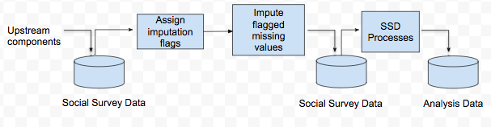

# Why use Machine Learning?
It was of interest to explore the utility of Machine Learning to directly impute for missing values in datasets. More specifically, the Methods Division was interested in examining whether Machine Learning models can improve the timeliness, reliability and accuracy of the imputation process in social survey data. Figure 1 presents the imputation pipeline for social survey data. Prior to imputation, units and values are reviewed, and those that are missing and should be routed to the item in question, are selected (i.e. flagged) for imputation. Data is then further processed by the Social Survey Division before imputed and observed data are compiled in an analysis dataset, used for publishing Official Statistics estimates.  

 

The intention was to use a machine learning system to impute flagged missing values. This model based approach for imputation may reduce the data processing time and improve the precision and reduce the variance of estimates. The current approach, which utilises nearest neighbour donor imputation involves the following:  
  
- Setting up specification files for each variable and imputation group combination  
- Iterating through weights for matching variables so that all missing values are imputed  
  
Designing the selection criteria for donors can be time consuming as it requires analysts to identify matching variables (MV), along with weights for each MV. Teams currently use subject matter expertise in designing the donor imputation strategy for each variable. As this process is not data driven, it introduces an element of subjectivity and does not guarantee that matching variables selected are the best predictors of the variable of interest. In contrast, a data driven approach would be reproducible and identify the best predictors, in the dataset, to estimate missing values. Moreover, applying the machine learning system may offer a more parsimonious approach as fewer input paramters and files would be required in executing imputation.  
  
The Methodology Division was interested in whether a Machine Learning System would perform better compared to the current imputation process with regards to:  
  
- Timeliness: Would the ML system reduce processing time and by how much?  
- Accuracy & Reliability: How do the two methods compare with respect to the bias and variance of estimates?  
- Interpretability: What advantages and challenges do the ML system present with regards to making the imputation methods transparent?    

At present, the following Machine Learning library was used in the investigation:  
  
- XGBoost  