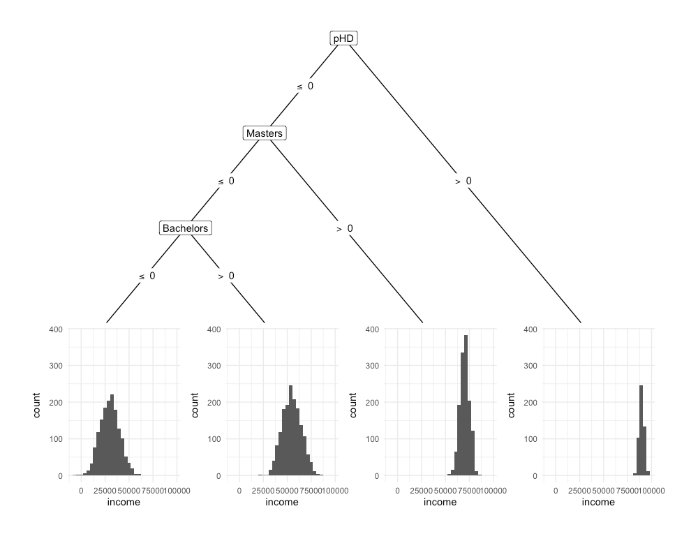

# XGBoost
XGBoost is a set of open source functions and steps, referred to as a library, that use supervised ML where analysts specify an outcome to be estiamted/ predicted. The XGBoost library uses multiple decision trees to predict an outcome.  
  
The ML system is trained using batch learning and generalised through a model based approach. It uses all available data to construct a model that specifies the relationship between the predictor and outcome variables, which are then generalised on the test data.  

XGBoost stands for eXtreme Gradient Boosting. The word "extreme" reflects its goal to push the limit of computational resources. Whereas gradient boosting is a machine learning technique for regression and classification problems that optimises a collection of weak prediction models in an attempt to build an accurate and reliable predictor.   

In order to build a better understanding of how XGBoost works, the documentation will briefly review:  
  
- Decision trees  
- Boosting  
- Regularisation  
  
## Decision trees
Decision trees can be used as a method for grouping units in a dataset by asking questions, such as "Does an individual have a Bachelor's degree?". In this example, two groups would be created; one for those with a Bachelor's degree, and one for those without. Figure 2 provides a visual depiction of this grouping in an attempt to explain Income. 


Each subsequent question in a decision tree will produce a smaller group of units. This grouping is carried out to identify units with similar characteristics with respect to an outcome variable. The model in Figure 3 attempts to use University qualifications to predict Income.   



The following characteristics are true of decision trees:  
  
- A single question is asked at each decision node, and there are only two possible choices. With the example in Figure 3, the questions include 1) Does individual have a pHD, 2) Does individual have a Master's and 3) Does individual have a Bachelor's degree.  
- At the bottom of every decision tree, there is a single possible decision. Every possible decision will eventually lead to a choice. Some decisions will lead to a choice sooner. The model in Figure 3 attempts to predict Income using University Qualifications. Each node presents the average income, size and percentage composition for a given subset of the dataset. The end nodes present the average income for individuals with the specified qualifications. As a result, the choices would be the expected value of Income for an individual, given the qualificaitons obtained.  

Decision trees are a learning method that involve a tree like graph to model either continuous or categorical choice given some data. It is composed of a series of binary questions, which when answered in succession yield a prediciton about data at hand. XGBoost uses Classification and Regression Trees (CART), which are presented in the above examples, to predict the outcome variable.  

### Boosting
A single decision tree is considered a weak/ base learner as it only slightly better than chance at predicting the outcome variable. Whereas strong learners are any algorithm that can be tuned to achieve peak performance for supervised learning. XGBoost uses decision trees as base learners; combining many weak learners to form a strong learner. As a result it is referred to as an ensemble learning method; using the output of many models (i.e. trees) in the final prediction.  

The concept of combining many weak learners to produce a strong learner is referred as boosting. XGBoost will iteratively build a set of weak models on subsets of the data; weighting each weak prediction according to the weak learner's performance. A prediction is derived by taking the weighted sum of all base learners.  

### Building models with XGBoost
In the training data, a target variable $y_{i}$ is specified, whilst all other features $x_{i}$ are used as predictors of the target variable. A collection of decision trees are used to predict values of $y_{i}$ using $x_{i}$. Individually, each decision tree, would be a weak predictor of the outcome variable. However, as a collective, the decision trees may enable analysts to make accurate and reliable predictions of $y_{i}$. As a result, the method for predicting the target variable using $x_{i}$ in XGBoost is referred to as decision tree ensembles. The steps below demonstrate how XGBoost was used to build a model, to predict income, using Univeristy Qualifications. 

1) Load the following packages
```{r step1_xgboost, eval=FALSE}
library(caret)
library(xgboost)
```

2) Load the dataset and remove the identifer
```{r step2_xgboost, eval=FALSE}
#### Load data #### 
load("data/Income_tree.RData")

#### Remove identifier ####
Income <- Income[,-1]
```

3) Split the dataset into training and test
```{r step3_xgboost, eval=FALSE}
#### Split data into training and test ####
set.seed(5)
s <- createDataPartition(Income$income, p = 0.8, list=FALSE)
training <- Income[s,]
test <- Income[-s,]
```

4) Convert the data into DMatrix objects, which is the recommended input type for xgboost
```{r step4_xgboost, eval=FALSE}
#### Convert the data to a matrix and assign output variable first ####
train.outcome <- training$income
train.predictors <- sparse.model.matrix(income ~ .,
                                        data = training
)[, -1]
test.outcome <- test$income
test.predictors <- model.matrix(income ~ .,
                                data = test
)[, -1]

#### Convert the matrix objects to DMatrix objects ####
dtrain <- xgb.DMatrix(train.predictors, label=train.outcome)
dtest <- xgb.DMatrix(test.predictors)
```

5) Train the model
```{r step5_xgboost, eval=FALSE}
#### Train the model ####
model <- xgboost(
  data = dtrain, max_depth = 2, eta = 1, nthread = 2, nrounds = 10,
  objective = "reg:linear")
```

6) Test the model
```{r step6_xgboost, eval=FALSE}
#### Test the model ####
pred <- predict(model, dtest)

#### Evaluate the performance of model ####
RMSE(pred,test.outcome)
```
7) Examine the importance of each feature in the model
```{r step7_xgboost, eval=FALSE}
#### Examine feature importance ####
importance_matrix <- xgb.importance(model = model)
print(importance_matrix)
xgb.plot.importance(importance_matrix = importance_matrix)
```

8) Plot the individual trees in the model
```{r step8_xgboost, eval=FALSE}
# Tree 1
xgb.plot.tree(model = model, tree=0)
# Tree 2
xgb.plot.tree(model = model, tree=1)
# Tree 3
xgb.plot.tree(model = model, tree=2)
```