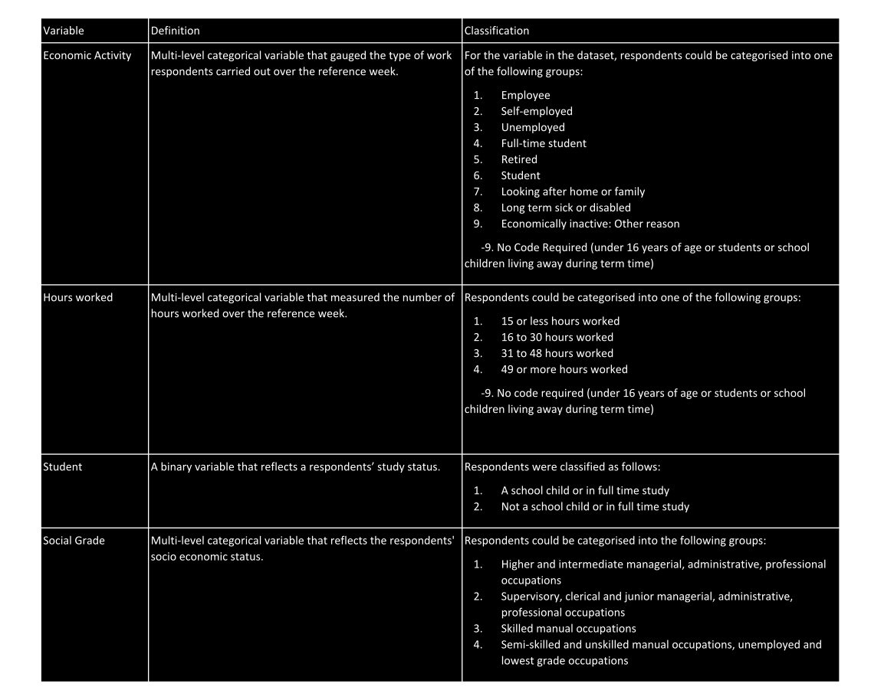

# Methods
The project evaluated the machine learning methods using:  
1) The Census Teaching File, an open dataset containing 1% of the person records from the 2011 Census in England & Wales.  
2) Survey Data

The code below specifies the packages used in the preparation, study and build of machine learning systems using the Census Teaching File.

```{r package-load, eval=FALSE}
```

## Census Teaching File
The Census Teaching File was downloaded from the [ONS website](https://www.ons.gov.uk/census/2011census/2011censusdata/censusmicrodata/microdatateachingfile) as a CSV file named "CensusTeachingFile", and was read into R using the following line of code. The dataset consisted of 569,741 individuals and 18 categorical variables from the 2011 Census population.  
```{r census-load, eval=FALSE}
```

Variables in the dataset were renamed and recoded so that:  
  
- Variable names were consisted with [Google's R style guide](https://google.github.io/styleguide/Rguide.xml)
- The response categories for all variables were numeric

```{r rename-recode-derive, eval=FALSE}
```

A preview of the dataset is provided below.

```{r preview, echo=FALSE}
load("data/Census.Rda")
kable(head(Census))
```

For the purposes of training and testing a machine learning system, the data was divided into training and test datasets using the following code.

```{r test-train-split, eval=FALSE}
```

The intention was to build models to predict each variable (listed in Table 1) using training data, which had no missingness. This model would then be evaluated with respect to its accuracy and generalisability using a test dataset, which would have missingness. The Census Teaching File was a complete dataset. As a result, missingness was simulated in the test dataset, and the imputation models (derived for each variable) were evaluated with regards to how well they predicted the true values.

Table 1. Variables to impute in Census Teaching File



