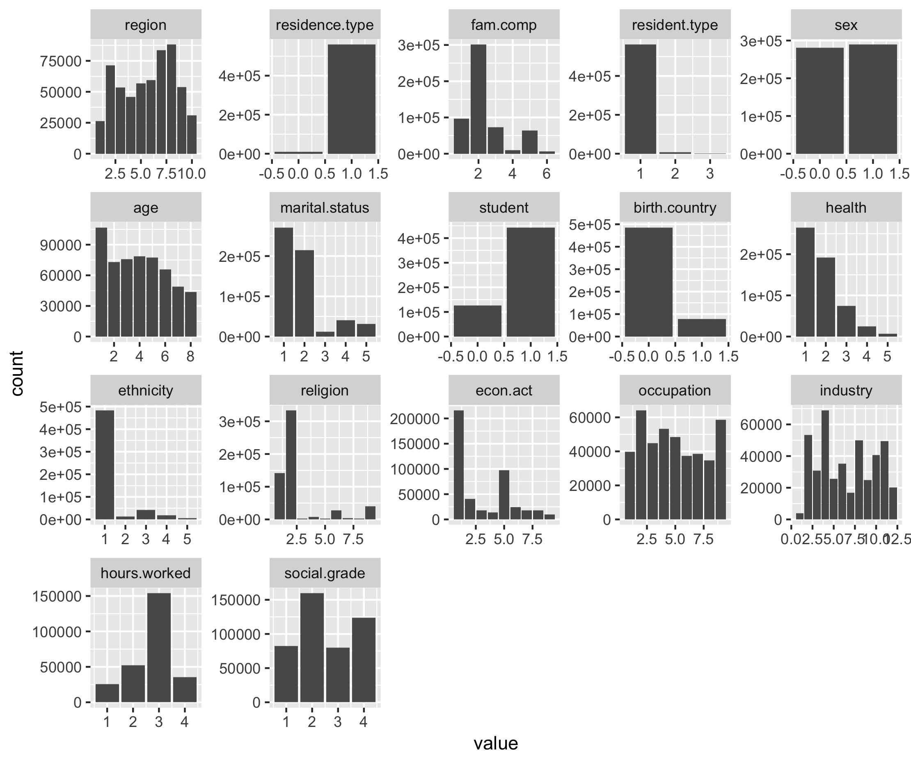
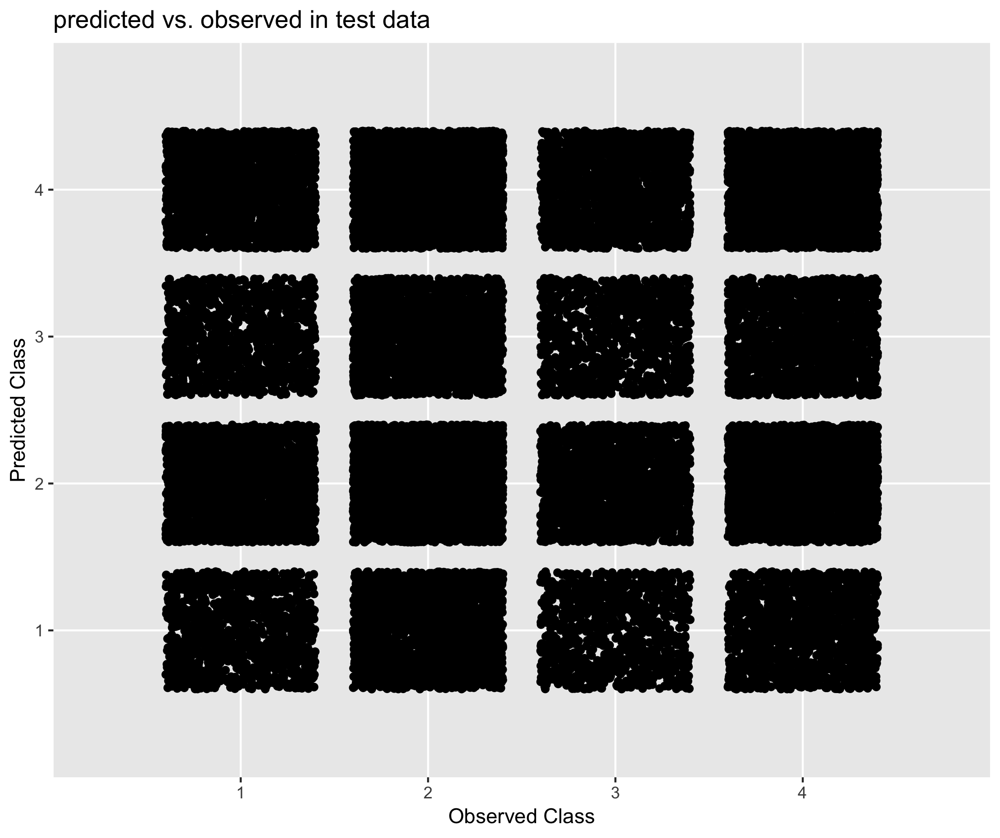
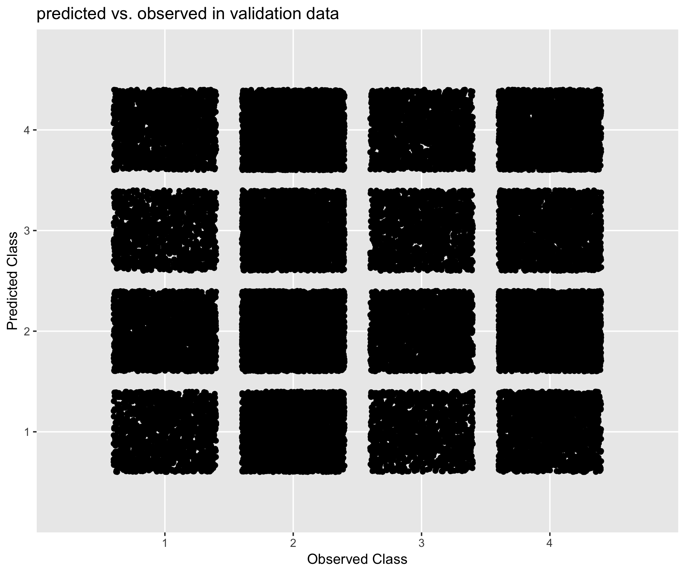

# Results

## Summary statistics
Summary statistics were produced to review the pattern of responses of individuals included in the dataset. Please note, that all comments that refer to respondents reflect only the respondents included in the 2011 Census Teaching File, and not descriptive statistics for the Census Population as a whole. Summary statistics produced using the dataset show that:  
  
- The majority of respondents resided in the South East and London. A relatively small proportion reside in North East and Wales.  
- Almost all respondents resided in a non-communal establishment  
- The majority of respondents were living in a family that was composed of a married or same-sex civil partnership couple  
- Almost all respondents were usual residents at the collection address during time of collection  
- There were a similar number of male and female respondents in the dataset  
- The majority of respondents were aged 0 to 15  
- The majority of respondents were single and had never married or registered for a same-sex civil partnership
- The majority of respondents were not school children nor were they in full time study
- The majority of respondents were born in the United Kingdom  
- The majority of respondents reported as being in very good health at time of collection
- With respect to Ethnicity, the majority of respondents identified as White  
- With respect to religion, the majority of respondents identified as Christian. The second largest group were those that stated they had no religion.  
- The two most prevalent categories for economic activity were employee and retired  
- Of those that were eligible to answer the Occupation item, the majority were either in a Professional or Elementary occupation  
- Of those that were eligible to answer the Industry item, the majority were employed in the Wholesale and retail trade industry  
- Of those that were eligible to answer the hours worked item, the majority worked between 31 and 38 hours per week  
- Of those elgible to answer the Social Grade item, the majority would be classed into the Supervisory, Clerical, and Junior Managerial social group  

```{r study-census-data, eval=FALSE}
```

Bar charts were used to review the distribution of responses for each categorical variable in the complete, training and test datasets (see Figures 2 to 4). As expected, there was a similar response pattern for a each variable between the complete, training and test datasets. The correlation matrix in Figure 5 presents the relationship between the variables in the complete dataset.    

```{r compare-test-train, eval=FALSE}
```




## Comparison of imputation methods
The results for the different imputation methods are presented for each imputable variable. Performance measures were selected based on the type of imputable variable used (i.e. categorical or continuous). Please refer to the links below for guidance on interpreting the performance measures:  

- [Root mean squared error](https://medium.com/human-in-a-machine-world/mae-and-rmse-which-metric-is-better-e60ac3bde13d) and [mean absolute error](https://medium.com/human-in-a-machine-world/mae-and-rmse-which-metric-is-better-e60ac3bde13d) (for continuous variables)  
- [Confusion matrix](https://www.dataschool.io/simple-guide-to-confusion-matrix-terminology/) (for categorical variables)  

For the categorical imputable variables, plots of the Observed vs Predicted are provided to give an indication of which categories each method predicted relatively well.

### Economic Activity

The results shows that:  

- XGBoost predicted economic activity with greater accuracy relative to donor and mode imputation  
- Compared to donor based methods, the XGBoost model appeared to have greater sensitivity for the different classes of economic activity. That is, for any given class of economic activity, the model based approach was more likely to predict the correct response relative to donor based methods.
- The Mixed Methods model was the least accurate imputation method for the multi-class variable, economic activity.

```{r econRes, echo=FALSE}
load("data/EconAct/CompareEconAct.RData")
kable(CompareEconAct)
```


### Hours worked 

The results shows that:  

- XGBoost predicted hours worked with greater accuracy relative to donor and mode imputation  
- Median imputation and the Mixed Methods approach had a similar level of accuracy  
- Donor based imputation had the lowest level of accuracy

```{r hoursRes, echo=FALSE}
load("data/HoursCont/CompareHoursCont.RData")
kable(CompareHoursCont)
```

### Social Grade

The results shows that:  

- All three approaches performed with similar degree of accuracy, whilst out-performing mode imputation   
- Compared to donor based methods, the XGBoost model appeared to have greater sensitivity for the different classes of social grade. That is, for any given class of social grade, the model based approach was more likely to predict the correct response relative to donor based methods.  

```{r socGRes, echo=FALSE}
load("data/SocialGrade/CompareSocGrad.RData")
kable(CompareSocGrad)
```






### Student

The results shows that:  

- All three approaches performed with similar degree of accuracy, whilst out-performing mode imputation   
- Compared to donor based methods, the XGBoost model appeared to have greater sensitivity for the different classes of student status. That is, for both students and non-students, the model based approach was more likely to predict the correct response relative to donor based methods.  

```{r stuRes, echo=FALSE}
load("data/Student/CompareStudent.RData")
kable(CompareStudent)
```


