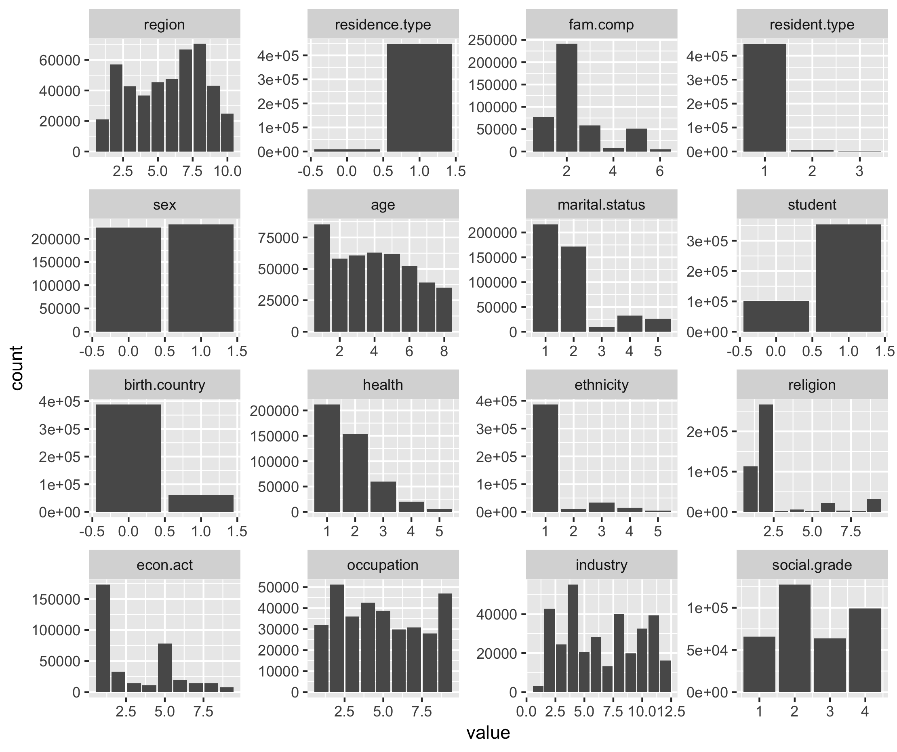
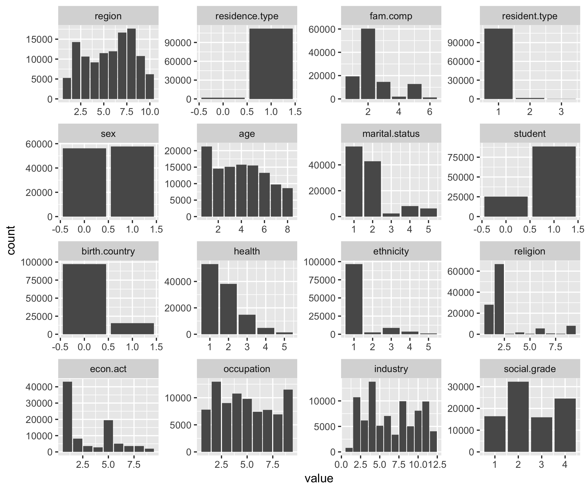

<style>
body {
text-align: justify}
</style>

```{r package-doc, message=FALSE, echo=FALSE}
source("WF1_package_load.R")
```

```{r setup, include=FALSE}
knitr::opts_knit$set(root.dir = here::here())
```

```{r external, include=FALSE}
knitr::read_chunk("WF1_package_load.R")
knitr::read_chunk("WF2_data_prep.R")
knitr::read_chunk("WF3_data_study.R")
knitr::read_chunk("WFM_EconAct.R")
knitr::read_chunk("WFM_HoursCont.R")
knitr::read_chunk("WFM_SocialGrade.R")
knitr::read_chunk("WFM_Student.R")
```

# What is Imputation?
Editing and imputing are both methods of data processing. Editing refers to the detection and correction of errors in the data. Whilst imputation is a method of correcting errors and estimating and filling in missing values in a dataset. Where there are errors in the dataset, and when these are considered to add no value in the correction process, these values are set to missing and are imputed with a plausible estimate. Alternatively, missing values may already exist in the data, and imputation may be carried out to produce a complete dataset for analysis.  
  
This research project evaluated the use of machine learning methods for imputation. In order to provide a context for using machine learning in the imputation process, the reader is presented with:  
  
- A rationale for carrying out imputation  
- An introduction to the methods of imputation

## Why is imputation carried out?
Missingness and erroneous values can impact the quality of data. A large volume of incorrect and/or missing values increase the risk of the product failing to capture the target concept or target population. That is, ommissions (introduced in collection or processing) may result in certain sub-groups of the target population from being excluded in the analysis dataset, and in turn increasing the risk of biased estimates, reducing the power of inferential statistics and increasing the uncertainty of estimates and inferences derived from the data. Similarly, errors in a dataset may impact the degree to which the final estimate or output represents the reality it was designed to capture.  
   
Correcting erroneous responses and filling in missing values helps manage the quality of data. A complete dataset can improve the accuracy and reliability of estimates, and help maintain the consistency of counts across published tables. Moreover, a dataset with fewer errors and more units may more accuately capture the underlying distribution of the variable of interest. Selecting a method for estimating values in a datset is generally advised by the nature of errors or missingness in the data, and the output desired from the analysis dataset.  

## Methods
An imputation process of a dataset can be broken down into the following three phases:  
  
1) Review, whereby data is examined for potential problems; identifying instances of missingness and erroneous values  
2) Select, whereby data is identified for further treatment. Of the potential problems identified in the review phase, a method is applied to determine which of these erroneous or missing cases need to be treated
3) Amend, whereby changes are applied to the data identified in the select phase by either correcting errors/ filling in missing values  

The focus of this project was in applying Machine Learning methods to amend values in a dataset. That is, it was of interest to compare existing approaches, of treating missing or erroneous values by estimating replacement figures, to machine learning methods. Methods of variable amendment can be grouped into one of the following categories:  
  
- interactive treatment  
- deductive imputation  
- model based imputation  
- donor based imputation  

The mechanisms for a given imputation method could be deterministic or stochastic. The former refers to instances where repeated trials of the same method yield identical output. Whereas the latter refers to instances where there is element of randomness; repeated iterations will produce different results.  

### Interactive treatment
Interactive treatment refers to a class of methods whereby the data are adjusted by a human editor by either re-contacting the respondent/ data provider, replacing values from another variable/ data source, or creating a value based on subject matter expertise.

### Deductive imputation
Deductive imputation uses logic or an understanding about the relationship between variables and units to fill in missing values. Examples include deriving a value as a function of other values, adopting a value from a related unit, and adopting a value from an earlier time point. Generally, this method is used when the true value can be derived with certainty or with a very high probability.  

### Model based imputation 
Model based imputation refers to a class of methods that estimate missing values using assumptions about the distribution of the data, which include mean and median imputation. Or assumptions about the relationship between auxiliary variables (or x variables) and the target y variable to predict missing values.

### Donor based imputation
Donor based imputation adopt values from an observed unit, which are then used for the missing unit. For each recipient with a missing value for variable y, a donor is identified that is similar to the recipient with respect to certain background characteristics (often referred to as matching variables) that are related to the target variable y. Such methods are relatively easy to apply when there are several related missing values in one record, and if the intention is to preserve the relationship between variables.

## Mechanisms
## Reasoning

# What is Machine Learning?
Machine learning is the field of study that enables a program to learn from its experience of iterating through a task multiple times. A performance measure is generally specified by the programmer, which is used to evaluate how well the machine has carried out the task at each iteration. Learning of the task is evidenced by its improvement against the performance measure.  
The different types of machine learning systems can be categorised with respect to:  
  
- Whether or not they are trained with human supervision  
- Whether or not they can learn incrementally or on the fly  
- Whether they work by comparing new data points to known data points, or instead detect patterns in the training data and build a predictive model  
  
## Supervision
Machine learning systems can vary with regards to the degree of supervision. The major types of supervision:  
  
- Supervised learning  
- Unsupervised learning  
- Semi-supervised learning  
- Reinforcement learning  
  
### Supervised learning
Supervised learning is the specification of the desired output. That is, the data used to train the model includes the solutions (which are referred to as labels), which the machine learning system attempts to estimate. The desired solutions specified in the machine learning algorithm are referred to as labels.  

### Unsupervised learning
Unsupervised learning uses training data that is unlabelled. In this class of machine learning systems, the outcome/ desired solutions are not specified in the machine learning algorithm.  

### Semi-supervised learning
Machine learning systems that use partially labelled data are categorised as utilising semi-supervised learning. 


### Reinforcement learning
Reinforcement learning involves the use of rewards or penalties to train the machine in identifying the appropriate action for a given situation. The learning system, which is referred to as an agent, observes the environment, selects and performs actions, and gets a response in the form of a reward or penalty. After multiple iterations, it identifies the best strategy, referred to as a policy, that results in the most reward over time.  
  
  
## Batch and Online learning
Another criterion for classifying machine learning systems is the way in which the algorithm learns. That is, whether the learning takes place at once or if it happens in increments.  

### Batch learning
Batch learning uses all the available data to train the machine learning system. This is generally time consuming and computationally expensive, and as a result is carried out offline. Whilst in production, the system is no longer learning, and is simply applying what it has learnt from the full set of training data.  

Any changes to the data generating mechanism (GDM) will mean that a new system would need to be trained, from scratch on the full set of data (that includes data points before and after changes to the GDM).  

### Online learning
Online learning trains the system incrementally through sequential input of data. Data can be delivered individually or in small groups, referred to as mini-batches. As each learning step is relatively fast and cheap, the system can learn about new data whilst in production, as it arrives. It is an ideal approach for when the velocity of new data is high, and when there is a need to adapt to changes rapidly or autonomously.  
  
## Approaches to generalisation
Machine learning systems can also be categorised with regards to how the systems generalise. That is, there are different approaches to using the training data to develop a system that can then be generalised to new cases. The two main approaches are instance-based learning and model-based learning.  

### Instance-based learning
Instance-based learning identifies all instances of a given feature in the training data and uses a similarity measure to generalise to new cases.  

### Model-based learning
Model-based learning uses features in the training data to predict the outcome/ variable of interest; the model used to specify the relationship between the predictor(s) and outcome(s) are then generalised on new cases.  

# Why use Machine Learning?
It was of interest to explore the utility of Machine Learning to directly impute for missing values in datasets. More specifically, the Methods Division was interested in examining whether Machine Learning models can improve the timeliness, reliability and accuracy of the imputation process in social survey data. Figure 1 presents the imputation pipeline for social survey data. Prior to imputation, units and values are reviewed, and those that are missing and should be routed to the item in question, are selected (i.e. flagged) for imputation. Data is then further processed by the Social Survey Division before imputed and observed data are compiled in an analysis dataset, used for publishing Official Statistics estimates.  

 

The intention was to use a machine learning system to impute flagged missing values. This model based approach for imputation may reduce the data processing time and improve the precision and reduce the variance of estimates. The current approach, which utilises nearest neighbour donor imputation involves the following:  
  
- Setting up specification files for each variable and imputation group combination  
- Iterating through weights for matching variables so that all missing values are imputed  
  
Designing the selection criteria for donors can be time consuming as it requires analysts to identify matching variables (MV), along with weights for each MV. Teams currently use subject matter expertise in designing the donor imputation strategy for each variable. As this process is not data driven, it introduces an element of subjectivity and does not guarantee that matching variables selected are the best predictors of the variable of interest. In contrast, a data driven approach would be reproducible and identify the best predictors, in the dataset, to estimate missing values. Moreover, applying the machine learning system may offer a more parsimonious approach as fewer input paramters and files would be required in executing imputation.  
  
The Methodology Division was interested in whether a Machine Learning System would perform better compared to the current imputation process with regards to:  
  
- Timeliness: Would the ML system reduce processing time and by how much?  
- Accuracy & Reliability: How do the two methods compare with respect to the bias and variance of estimates?  
- Interpretability: What advantages and challenges do the ML system present with regards to making the imputation methods transparent?    
    
# Machine Learning methods
The following Machine Learning tools were used in the investigation:  
  
- XGBoost  
- Generative Adverserial Networks  
- Autoencoder  

## XGBoost
XGBoost is a set of open source functions and steps, referred to as a library, that use supervised ML where analysts specify an outcome to be estiamted/ predicted. The XGBoost library uses multiple decision trees to predict an outcome.  
  
The ML system is trained using batch learning and generalised through a model based approach. It uses all available data to construct a model that specifies the relationship between the predictor and outcome variables, which are then generalised on the test data.  

XGBoost stands for eXtreme Gradient Boosting. The word "extreme" reflects its goal to push the limit of computational resources. Whereas gradient boosting is a machine learning technique for regression and classification problems that optimises a collection of weak prediction models in an attempt to build an accurate and reliable predictor.   

In order to build a better understanding of how XGBoost works, the documentation will briefly review:  
  
- Decision trees  
- Boosting  
- Regularisation  
  
### Decision trees
Decision trees can be used as a method for grouping units in a dataset by asking questions, such as "Does an individual have a Bachelor's degree?". In this example, two groups would be created; one for those with a Bachelor's degree, and one for those without. Figure 2 provides a visual depiction of this grouping in an attempt to explain Income. 


Each subsequent question in a decision tree will produce a smaller group of units. This grouping is carried out to identify units with similar characteristics with respect to an outcome variable. The model in Figure 3 attempts to use University qualifications to predict Income.   


The following characteristics are true of decision trees:  
  
- A single question is asked at each decision node, and there are only two possible choices. With the example in Figure 3, the questions include 1) Does individual have a pHD, 2) Does individual have a Master's and 3) Does individual have a Bachelor's degree.  
- At the bottom of every decision tree, there is a single possible decision. Every possible decision will eventually lead to a choice. Some decisions will lead to a choice sooner. The model in Figure 3 attempts to predict Income using University Qualifications. Each node presents the average income, size and percentage composition for a given subset of the dataset. The end nodes present the average income for individuals with the specified qualifications. As a result, the choices would be the expected value of Income for an individual, given the qualificaitons obtained.  

Decision trees are a learning method that involve a tree like graph to model either continuous or categorical choice given some data. It is composed of a series of binary questions, which when answered in succession yield a prediciton about data at hand. XGBoost uses Classification and Regression Trees (CART), which are presented in the above examples, to predict the outcome variable.  

### Boosting
A single decision tree is considered a weak/ base learner as it only slightly better than chance at predicting the outcome variable. Whereas strong learners are any algorithm that can be tuned to achieve peak performance for supervised learning. XGBoost uses decision trees as base learners; combining many weak learners to form a strong learner. As a result it is referred to as an ensemble learning method; using the output of many models (i.e. trees) in the final prediction.  

The concept of combining many weak learners to produce a strong learner is referred as boosting. XGBoost will iteratively build a set of weak models on subsets of the data; weighting each weak prediction according to the weak learner's performance. A prediction is derived by taking the weighted sum of all base learners.  

### Building models with XGBoost
In the training data, a target variable $y_{i}$ is specified, whilst all other features $x_{i}$ are used as predictors of the target variable. A collection of decision trees are used to predict values of $y_{i}$ using $x_{i}$. Individually, each decision tree, would be a weak predictor of the outcome variable. However, as a collective, the decision trees may enable analysts to make accurate and reliable predictions of $y_{i}$. As a result, the method for predicting the target variable using $x_{i}$ in XGBoost is referred to as decision tree ensembles. The steps below demonstrate how XGBoost was used to build a model, to predict income, using Univeristy Qualifications. 

1) Load the following packages
```{r step1_xgboost, eval=FALSE}
library(caret)
library(xgboost)
```

2) Load the dataset and remove the identifer
```{r step2_xgboost, eval=FALSE}
#### Load data #### 
load("data/Income_tree.RData")

#### Remove identifier ####
Income <- Income[,-1]
```

3) Split the dataset into training and test
```{r step3_xgboost, eval=FALSE}
#### Split data into training and test ####
set.seed(5)
s <- createDataPartition(Income$income, p = 0.8, list=FALSE)
training <- Income[s,]
test <- Income[-s,]
```

4) Convert the data into DMatrix objects, which is the recommended input type for xgboost
```{r step4_xgboost, eval=FALSE}
#### Convert the data to a matrix and assign output variable first ####
train.outcome <- training$income
train.predictors <- sparse.model.matrix(income ~ .,
                                        data = training
)[, -1]
test.outcome <- test$income
test.predictors <- model.matrix(income ~ .,
                                data = test
)[, -1]

#### Convert the matrix objects to DMatrix objects ####
dtrain <- xgb.DMatrix(train.predictors, label=train.outcome)
dtest <- xgb.DMatrix(test.predictors)
```

5) Train the model
```{r step5_xgboost, eval=FALSE}
#### Train the model ####
model <- xgboost(
  data = dtrain, max_depth = 2, eta = 1, nthread = 2, nrounds = 10,
  objective = "reg:linear")
```

6) Test the model
```{r step6_xgboost, eval=FALSE}
#### Test the model ####
pred <- predict(model, dtest)

#### Evaluate the performance of model ####
RMSE(pred,test.outcome)
```
7) Examine the importance of each feature in the model
```{r step7_xgboost, eval=FALSE}
#### Examine feature importance ####
importance_matrix <- xgb.importance(model = model)
print(importance_matrix)
xgb.plot.importance(importance_matrix = importance_matrix)
```

8) Plot the individual trees in the model
```{r step8_xgboost, eval=FALSE}
# Tree 1
xgb.plot.tree(model = model, tree=0)
# Tree 2
xgb.plot.tree(model = model, tree=1)
# Tree 3
xgb.plot.tree(model = model, tree=2)
```

# Methods
The project evaluated the machine learning methods using:  
1) The Census Teaching File, an open dataset containing 1% of the person records from the 2011 Census in England & Wales.  
2) Survey Data

The code below specifies the packages used in the preparation, study and build of machine learning systems using the Census Teaching File.

```{r package-load, eval=FALSE}
```

## Census Teaching File
The Census Teaching File was downloaded from the [ONS website](https://www.ons.gov.uk/census/2011census/2011censusdata/censusmicrodata/microdatateachingfile) as a CSV file named "CensusTeachingFile", and was read into R using the following line of code. The dataset consisted of 569,741 individuals and 18 categorical variables from the 2011 Census population.  
```{r census-load, eval=FALSE}
```

Variables in the dataset were renamed and recoded so that:  
  
- Variable names were consisted with [Google's R style guide](https://google.github.io/styleguide/Rguide.xml)
- The response categories for all variables were numeric

```{r rename-recode-derive, eval=FALSE}
```

A preview of the dataset is provided below.

```{r preview, echo=FALSE}
load("data/Census.Rda")
head(Census)
```

For the purposes of training and testing a machine learning system, the data was divided into training and test datasets using the following code.

```{r test-train-split, eval=FALSE}
```

The intention was to build models to predict each variable (listed in Table 1) using training data, which had no missingness. This model would then be evaluated with respect to its accuracy and generalisability using a test dataset, which would have missingness. The Census Teaching File was a complete dataset. As a result, missingness was simulated in the test dataset, and the imputation models (derived for each variable) were evaluated with regards to how well they predicted the true values.

Table 1. Variables to impute in Census Teaching File


Summary statistics were produced to review the pattern of responses of individuals included in the dataset. Please note, that all comments that refer to respondents reflect only the respondents included in the 2011 Census Teaching File, and not descriptive statistics for the Census Population as a whole. Summary statistics produced using the dataset show that:  
  
- The majority of respondents resided in the South East and London. A relatively small proportion reside in North East and Wales.  
- Almost all respondents resided in a non-communal establishment  
- The majority of respondents were living in a family that was composed of a married or same-sex civil partnership couple  
- Almost all respondents were usual residents at the collection address during time of collection  
- There were a similar number of male and female respondents in the dataset  
- The majority of respondents were aged 0 to 15  
- The majority of respondents were single and had never married or registered for a same-sex civil partnership
- The majority of respondents were not school children nor were they in full time study
- The majority of respondents were born in the United Kingdom  
- The majority of respondents reported as being in very good health at time of collection
- With respect to Ethnicity, the majority of respondents identified as White  
- With respect to religion, the majority of respondents identified as Christian. The second largest group were those that stated they had no religion.  
- The two most prevalent categories for economic activity were employee and retired  
- Of those that were eligible to answer the Occupation item, the majority were either in a Professional or Elementary occupation
- Of those that were eligible to answer the Industry item, the majority were employed in the Wholesale and retail trade industry  
- Of those that were eligible to answer the hours worked item, the majority worked between 31 and 38 hours per week  
- Of those elgible to answer the Social Grade item, the majority would be classed into the Supervisory, Clerical, and Junior Managerial social group  

```{r study-census-data, eval=FALSE}
```

Bar charts were used to review the distribution of responses for each categorical variable in the complete, training and test datasets (see Figures 2 to 4). As expected, there was a similar response pattern for a each variable between the complete, training and test datasets. The correlation matrix in Figure 5 presents the relationship between the variables in the complete dataset.    

```{r compare-test-train, eval=FALSE}
```







<!-- ### Gradient descent -->
<!-- The weights for each variable in the model are constantly modified in order to minimse the variation not explained by the model. This is referred to as gradient descent.  -->

# Results {.tabset .tabset-fade .tabset-pills}

## Economic Activity


## Hours worked 


## Social Grade


## Student

