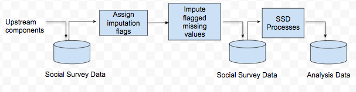

<style>
body {
text-align: justify}
</style>

# What is Imputation?
## Introduction
## Methods
## Mechanisms
## Reasoning

# What is Machine Learning?
Machine learning is the field of study that enables a program to learn from its experience of iterating through a task multiple times. A performance measure is generally specified by the programmer, which is used to evaluate how well the machine has carried out the task at each iteration. Learning of the task is evidenced by its improvement against the performance measure.  
The different types of machine learning systems can be categorised with respect to:  
    - Whether or not they are trained with human supervision  
    - Whether or not they can learn incrementally or on the fly  
    - Whether they work by comparing new data points to known data points, or instead detect patterns in the training data and build a predictive model  
  
## Supervision
Machine learning systems can vary with regards to the degree of supervision. The major types of supervision:  
    - Supervised learning  
    - Unsupervised learning  
    - Semi-supervised learning  
    - Reinforcement learning  
  
### Supervised learning
Supervised learning is the specification of the desired output. That is, the data used to train the model includes the solutions (which are referred to as labels), which the machine learning system attempts to estimate. The desired solutions specified in the machine learning algorithm are referred to as labels.  

### Unsupervised learning
Unsupervised learning uses training data that is unlabelled. In this class of machine learning systems, the outcome/ desired solutions are not specified in the machine learning algorithm.  

### Semi-supervised learning
Machine learning systems that use partially labelled data are categorised as utilising semi-supervised learning. 


### Reinforcement learning
Reinforcement learning involves the use of rewards or penalties to train the machine in identifying the appropriate action for a given situation. The learning system, which is referred to as an agent, observes the environment, selects and performs actions, and gets a response in the form of a reward or penalty. After multiple iterations, it identifies the best strategy, referred to as a policy, that results in the most reward over time.  
  
  
## Batch and Online learning
Another criterion for classifying machine learning systems is the way in which the algorithm learns. That is, whether the learning takes place at once or if it happens in increments.  

### Batch learning
Batch learning uses all the available data to train the machine learning system. This is generally time consuming and computationally expensive, and as a result is carried out offline. Whilst in production, the system is no longer learning, and is simply applying what it has learnt from the full set of training data.  

Any changes to the data generating mechanism (GDM) will mean that a new system would need to be trained, from scratch on the full set of data (that includes data points before and after changes to the GDM).  

### Online learning
Online learning trains the system incrementally through sequential input of data. Data can be delivered individually or in small groups, referred to as mini-batches. As each learning step is relatively fast and cheap, the system can learn about new data whilst in production, as it arrives. It is an ideal approach for when the velocity of new data is high, and when there is a need to adapt to changes rapidly or autonomously.  
  
## Approaches to generalisation
Machine learning systems can also be categorised with regards to how the systems generalise. That is, there are different approaches to using the training data to develop a system that can then be generalised to new cases. The two main approaches are instance-based learning and model-based learning.  

### Instance-based learning
Instance-based learning identifies all instances of a given feature in the training data and uses a similarity measure to generalise to new cases.  

### Model-based learning
Model-based learning uses features in the training data to predict the outcome/ variable of interest; the model used to specify the relationship between the predictor(s) and outcome(s) are then generalised on new cases.  

# Why use Machine Learning?
It is of interest to explore the utility of Machine Learning to directly impute for missing values in datasets. More specifically, the Methods Division is interested in examining whether Machine Learning models can improve the timeliness, reliability and accuracy of the imputation process in social survey data. Figure 1 presents the imputation pipeline for social survey data. Prior to imputation, units and values are reviewed, and those that are missing and should be routed to the item in question, are selected (i.e. flagged) for imputation. Data is then further processed by the Social Survey Division before imputed and observed data are compiled in an analysis dataset, used for publishing Official Statistics estimates.  

 

The intention is to use a machine learning system to impute flagged missing values. This model based approach for imputation may reduce the data processing time and improve the precision and reduce the variance of estimates. The current approach, which utilises nearest neighbour donor imputation involves the following:  
    - Setting up specification files for each variable and imputation group combination  
    - Iterating through weights for matching variables so that all missing values are imputed  
  
Designing the selection criteria for donors can be time consuming as it requires analysts to identify matching variables (MV), along with weights for each MV. Teams currently use subject matter expertise in designing the donor imputation strategy for each variable. As this process is not data driven, it introduces an element of subjectivity and does not guarantee that matching variables selected are the best predictors of the variable of interest. In contrast, a data driven approach would be reproducible and identify the best predictors, in the dataset, to estimate missing values. Moreover, applying the machine learning system may offer a more parsimonious approach as fewer input paramters and files would be required in executing imputation.  
  
The Methodology Division was interested in whether a Machine Learning System would perform better compared to the current imputation process with regards to:
    - Timeliness: Would the ML system reduce processing time and by how much?
    - Accuracy & Reliability: How do the two methods compare with respect to the bias and variance of estimates?
    - Interpretability: What advantages and challenges do the ML system present with regards to making the imputation methods transparent?  
    
# Machine Learning methods
The following Machine Learning tools were used in the investigation:  
- XGBoost  
- Generative Adverserial Networks  
- Autoencoder  

## XGBoost
XGBoost is a method of supervised ML where analysts specify an outcome to be estiamted/ predicted. XGBoost uses multiple decision trees to predict outcomes whereby each tree, after the first, is constructed to explain variance not explained by the preceding trees. This is referred to as a boosting approach.  
  
The ML system is trained using batch learning and generalised through a model based approach; using all the available data to construct a model that specifies the relationship between the predictor and outcome variables, which are then generalised on the test data.  

# Methods
The project evaluated the machine learning methods using:  
1) The Census Teaching, a open dataset containing 1% of the person records from the 2011 Census in England & Wales.
2) Survey Data

The code below specifies the packages used in the preparation, study and build of machine learning systems using the Census Teaching File.

```{r packages, eval=FALSE}
library(tidyverse)
library(mice)
library(reshape2)
library(GGally)
library(Matrix)
library(xgboost)
```

## Census Teaching File
The Census Teaching File was downloaded from the [ONS website](https://www.ons.gov.uk/census/2011census/2011censusdata/censusmicrodata/microdatateachingfile) as a CSV file named "CensusTeachingFile", and was read into R using the following line of code. 

```{r eval=FALSE}
CensusRaw <- read.csv(file="data/CensusTeachingFile.csv", skip=1, header=TRUE, sep=",")
```

Variables in the dataset were renamed and recoded so that:  
- There were no spaces or periods in variable names
- The response categories for all variables were numeric

```{r dataclean, eval=FALSE}
#Convert variables of type factor to character in order to recode responses for variables of this type
Census %>% mutate_if(is.factor, as.character) -> Census

#Rename variables
Census<-plyr::rename(CensusRaw, c("Person.ID"="PersonID",
                                  "Residence.Type"="ResidenceType", 
                                  "Family.Composition"="FamComp", 
                                  "Population.Base"="ResidentType", 
                                  "Marital.Status"="MaritalStatus",
                                  "Country.of.Birth"="BirthCountry",
                                  "Ethnic.Group"="Ethnicity",
                                  "Economic.Activity"="EconAct",
                                  "Hours.worked.per.week"="HoursWorked",
                                  "Approximated.Social.Grade"="SocialGrade"))

#Recode the Region and Residence Type variables so that they are numeric
Census$Region[Census$Region=="E12000001"] <- 1
Census$Region[Census$Region=="E12000002"] <- 2
Census$Region[Census$Region=="E12000003"] <- 3
Census$Region[Census$Region=="E12000004"] <- 4
Census$Region[Census$Region=="E12000005"] <- 5
Census$Region[Census$Region=="E12000006"] <- 6
Census$Region[Census$Region=="E12000007"] <- 7
Census$Region[Census$Region=="E12000008"] <- 8
Census$Region[Census$Region=="E12000009"] <- 9
Census$Region[Census$Region=="W92000004"] <- 10

Census$ResidenceType[Census$ResidenceType=="C"] <- 1
Census$ResidenceType[Census$ResidenceType=="H"] <- 2

#Ensure all variables are except PersonID coded as numeric. The package used to simulate missingness requires that all variables where missingness is simulated are numeric. PersonID will not have any missingness.
Census %>% mutate_if(is.character, as.numeric) -> Census
Census$PersonID<-as.character(Census$PersonID)

```

A preview of the dataset is provided below.

```{r preview, echo=FALSE}
load("data/Census.Rda")
head(Census)
```

For the purposes of training and testing a machine learning system, the data was divided into training and test datasets using the following code.

```{r TestTrain, eval=FALSE}
set.seed(5)
Census80 <- sample(1:nrow(Census),0.8 * nrow(Census), replace=FALSE)
Census20 <- setdiff(1:nrow(Census), Census80)

Census.train<-Census[Census80,]
Census.test<-Census[Census20,]
```

The intention was to build a model to predict a given variable using training data, which would have complete cases for all variables. This model would then be evaluated with respect to its accuracy and generalisability using test and validation datasets, which would have missingness.  

The Census Teaching File was a complete dataset. As a result, missingness was simulated using the code below, and imputation models were derived for variables listes in Table 1.

```{r missSim, eval=FALSE}
#Ampute test dataset (i.e. simulate missingness)
Census.test.amp<-ampute(Census.test[,-1], prop=0.5)
Census.test.miss<-Census.test.amp$amp

#Recode all NAs to -999. This is required in order to use the XGBoost function, as this in turn requires data frames to be converted to a matrix, which requires numeric objects
Census.test.miss[is.na(Census.test.miss)] <- -999
```

Table 1. Variables to impute in Census Teaching File


<!-- ### Gradient descent -->
<!-- The weights for each variable in the model are constantly modified in order to minimse the variation not explained by the model. This is referred to as gradient descent.  -->

