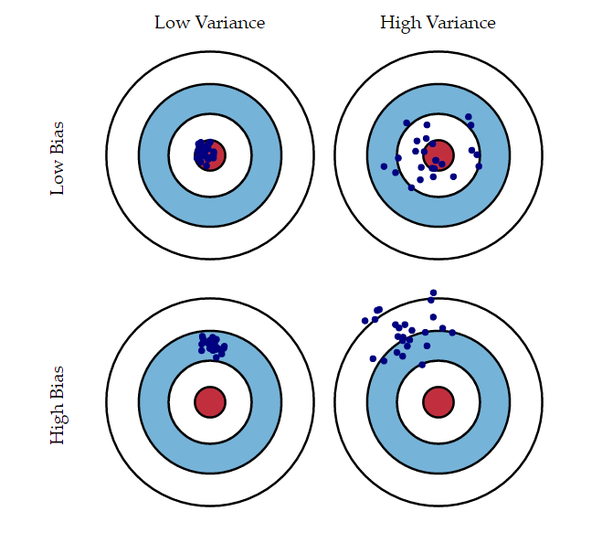
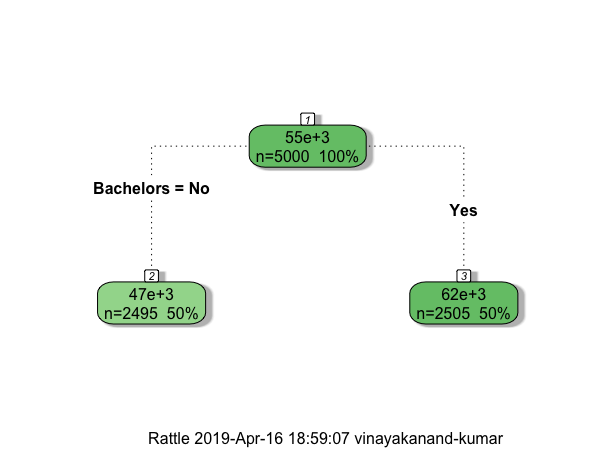
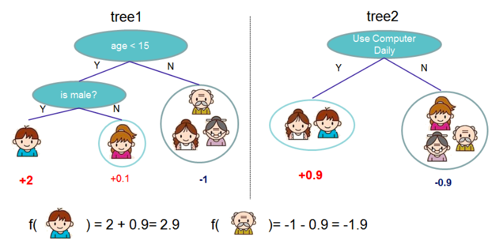

# Introduction

## What we will cover?

<aside class="notes">
- What is imputation?
- Why is imputation important?
- What is Machine Learning?
- Why use Machine Learning?
- My Machine Learning method
- How did it perform?
- Lessons
</aside>

# Imputation

## What is imputation?

<aside class="notes">
Editing and imputing are both methods of data processing. Editing refers to the detection and correction of errors in the data. Whilst imputation is a method of correcting errors and estimating and filling in missing values in a dataset.

Types of imputation
- Interactive treatment  
- Deductive  
- Model based  
- Donor based  

</aside>

## Why is imputation important?

<aside class="notes">
Imputation is important because:
1) it adjusts for potential bias
2) it reduces the variance of estimates

Missingness and erroneous values can impact the quality of data. A large volume of incorrect and/or missing values increase the risk of the product failing to capture the target concept or target population. Impact of missingness include:  
- excluding sub-groups of the target population from the analysis dataset  
- reducing power of inferential statistics  
These challenges can increase the risk of producing biased estimates, and increase the uncertainty of estiamtes derived from the data.  

Imputation can help manage the quality of data:
- By filling in missing values, you create a complete dataset, which can improve the accuracy and reliability of estimates, and help maintain the consistency of counts across published tables.  
- A dataset with fewer errors and more units may more accurately capture the underlying distribution of the variable of interest. 
</aside>

# Machine Learning

## What is Machine Learning?

<aside class="notes">
Machine learning is the field of study that enables a program to learn from its experience of iterating through a task multiple times. A performance measure is generally specified by the programmer, which is used to evaluate how well the machine has carried out the task at each iteration.  

In the context of imputation, the task is estimating values where there was missingness. And the performance measure is how close the the imputed value was to the actual value. This task is repeated multiple times and each time, we see if the performance improved, in order to build our final model.
</aside>

## Why use Machine Learning?

<aside class="notes">
1) To Learn about machine learning  
2) Limitations of donor based methods  
    - Selection of matching variables and weights not always data driven
    - Difficult to review when there are a large number of variables
    - Donor based methods can fail to find donors
    - Can be time consuming to set up

My project was interested in comparing a Machine Learning system to a donor 
based method for imputation.
</aside>

# My Machine Learning method

## Decision Trees

<aside class="notes">
My Machine Learning method used decision trees, which are a useful method
for grouping units in a dataset. For example, in a dataset where you've collected
income information about respondents, you might want to group units based on whether
they have a bachelors degree or not. Using this grouping, you can see that 
those with a bachelors degree have a higher average income than those without
a bachelors degree. As a result, you maybe able to use information about 
qualifications to predict income.

In this example, we use a single decision tree to group our units. A single 
decision tree is referred to as a weak learner becaue it is only slighlty better 
than chance at predicting the outcome variable.
</aside>

## Lots of Decision Trees

<aside class="notes">
My Machine Learning method uses mutliple decision trees. It combines many 
weak learners to form a strong learner.  

Each subsequent decision tree tries to explain the variance not explained 
by the preceding tree.
</aside>

## How did it perform?

<aside class="notes">
Using the Census teaching file, the machine learning system outperformed donor
based imputation on the following types of variables:
- Multi-class
- Binary
</aside>

# Lessons

## Future direction

<aside class="notes">
Future directions for applying machine learning in imputation include:  
- multi-variate imputation
- estimating uncertainty
- using this method to select matching variables
</aside>

## The Academy

<aside class="notes">
I am very grateful for the academy:
- I appreciated the guidance and support
- I really enjoyed being able to create something
- I now have an understanding of how to apply gradient boosted trees
- I was able to carry out a piece of work that will be potentially be presented at numerous conferences
- I understand my own imputation tools better than I did before the academy
The model that the academy use to teach/ train is excellent and am 100% on board.
</aside>
